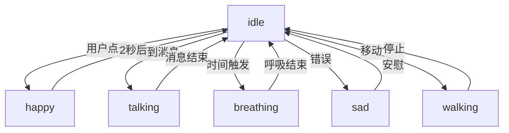

# Live2D 引入重构规划文档

## 文档概述

本文档详细分析了当前项目结构的问题，并规划了引入 Live2D 后的架构重构方向。

**文档版本：** v1.0  
**创建日期：** 2026-01-07  
**最后更新：** 2026-01-07

---

## 一、当前项目结构分析

### 1.1 现状描述

当前项目的所有功能高度集中在 `src/frontend/pet.py` 文件中，该文件承担了过多的职责：

```python
src/frontend/pet.py (约 600+ 行代码)
├── DesktopPet 类 (主窗口)
│   ├── UI 初始化 (init_ui)
│   ├── 托盘图标管理 (init_tray_icon)
│   ├── 气泡系统集成
│   ├── 截图功能
│   ├── 移动管理 (MoveWorker 线程)
│   ├── 交互事件处理
│   └── 动画渲染（静态图片）
```

### 1.2 核心问题

#### 问题 1：单一职责原则违反

**现象：**
- `DesktopPet` 类同时承担了窗口管理、动画渲染、交互控制、系统托盘等多个职责
- 代码耦合度高，难以维护和测试

**影响：**
- ❌ 修改一个功能可能影响其他功能
- ❌ 单元测试困难
- ❌ 代码复用性差
- ❌ 新增功能时需要修改核心类

#### 问题 2：动画渲染架构僵化

**现状：**
```python
# 当前实现：静态 QLabel 显示
self.pet_image = QLabel(self)
pixmap = QPixmap("./img/small_maimai.png")
self.pet_image.setPixmap(pixmap)
```

**问题：**
- ❌ 无法支持动态动画
- ❌ 无法切换不同的显示模式（静态图片 vs Live2D）
- ❌ 动画逻辑与窗口逻辑耦合
- ❌ 难以扩展到 Live2D 等高级动画技术

#### 问题 3：子窗口管理混乱

**现状：**
```python
# 所有子窗口都依赖 DesktopPet 实例
self.chat_bubbles = SpeechBubbleList(parent=self)
self.bubble_menu = BubbleMenu()
self.bubble_input = BubbleInput(parent=self, ...)
self.screenshot_selector = None
```

**问题：**
- ❌ 子窗口与主窗口强耦合
- ❌ 难以测试和复用子窗口组件
- ❌ 窗口位置同步逻辑分散在多处

#### 问题 4：事件处理缺乏分层

**现状：**
- 所有事件处理都在 `DesktopPet` 类中
- 缺乏清晰的事件流转机制
- 业务逻辑与 UI 逻辑混合

**问题：**
- ❌ 事件处理逻辑复杂
- ❌ 难以追踪事件流
- ❌ 缺乏统一的状态管理

### 1.3 技术债务清单

| 债务项 | 严重程度 | 影响范围 | 优先级 |
|--------|----------|----------|--------|
| 单一类承担过多职责 | 高 | 整个项目架构 | P0 |
| 动画渲染无法扩展 | 高 | 核心功能 | P0 |
| 缺乏分层架构 | 中 | 可维护性 | P1 |
| 子窗口管理混乱 | 中 | 用户体验 | P1 |
| 缺乏统一状态管理 | 中 | 交互逻辑 | P2 |
| 缺乏单元测试 | 中 | 代码质量 | P2 |

---

## 二、引入 Live2D 的挑战

### 2.1 技术挑战

#### 挑战 1：渲染架构重构

**需求：**
- Live2D 需要使用 OpenGL 或专门的渲染器
- 需要支持 60FPS 的实时渲染
- 需要处理模型加载、动作播放、表情切换等

**当前问题：**
- 静态 QLabel 无法满足 Live2D 的渲染需求
- 需要引入 OpenGL 上下文管理
- 需要重构整个渲染管线

#### 挑战 2：模型资源管理

**需求：**
```
live2d/
├── models/
│   ├── maotai/
│   │   ├── maotai.moc3
│   │   ├── maotai.model3.json
│   │   ├── textures/
│   │   ├── motions/
│   │   └── expressions/
```

**当前问题：**
- 缺乏模型资源加载器
- 缺乏模型切换机制
- 缺乏资源缓存管理

#### 挑战 3：交互适配

**需求：**
- 鼠标追踪（注视效果）
- 点击反馈（物理效果）
- 状态切换（idle, happy, sad 等）

**当前问题：**
- 缺乏统一的交互抽象层
- 不同显示模式（静态/Live2D）的交互逻辑不统一

### 2.2 架构挑战

#### 挑战 1：显示模式切换

**需求：**
- 支持静态图片和 Live2D 两种模式
- 运行时动态切换
- 保持子窗口系统兼容

**设计问题：**
- 如何抽象显示接口？
- 如何保证两种模式的一致性？
- 如何处理性能差异？

#### 挑战 2：组件解耦

**需求：**
- 将动画渲染从主窗口分离
- 保持子窗口系统的独立性
- 提供清晰的组件通信机制

**设计问题：**
- 如何设计组件接口？
- 如何处理组件间的依赖？
- 如何保证可测试性？

---

## 三、重构架构设计

### 3.1 整体架构目标

**核心原则：**
1. **分层架构**：UI 层、逻辑层、数据层分离
2. **单一职责**：每个类只负责一个功能
3. **依赖倒置**：高层模块不依赖低层模块
4. **开闭原则**：对扩展开放，对修改关闭

**架构图：**

```
┌─────────────────────────────────────────────────────────┐
│                    Presentation Layer                     │
│  ┌──────────────┐  ┌──────────────┐  ┌──────────────┐  │
│  │  DesktopPet  │  │ BubbleSystem │  │ TrayManager  │  │
│  │   (窗口)     │  │  (气泡系统)   │  │  (托盘管理)  │  │
│  └──────────────┘  └──────────────┘  └──────────────┘  │
│           │                 │                 │        │
└───────────┼─────────────────┼─────────────────┼────────┘
            │                 │                 │
┌───────────┼─────────────────┼─────────────────┼────────┐
│           ▼                 ▼                 ▼        │
│         ┌──────────────────────────────────────┐       │
│         │      Presentation Layer (Core)       │       │
│  ┌──────────────┐  ┌──────────────┐  ┌──────────────┐ │
│  │RenderManager │  │EventManager  │  │ StateManager │ │
│  │  (渲染管理)  │  │  (事件管理)  │  │  (状态管理)  │ │
│  └──────────────┘  └──────────────┘  └──────────────┘ │
│           │                 │                 │        │
│           ▼                 ▼                 ▼        │
│  ┌──────────────┐  ┌──────────────┐  ┌──────────────┐ │
│  │   IRenderer  │  │ IEventHandler│  │   IState     │ │
│  │  (渲染接口)  │  │ (事件接口)   │  │  (状态接口)  │ │
│  └──────────────┘  └──────────────┘  └──────────────┘ │
└──────────────────────────────────────────────────────┘
            │                 │                 │
┌───────────┼─────────────────┼─────────────────┼────────┐
│           ▼                 ▼                 ▼        │
│         ┌──────────────────────────────────────┐       │
│            Business Layer (Core)               │       │
│  ┌──────────────┐  ┌──────────────┐  ┌──────────────┐ │
│  │ Live2DRenderer│ │StaticRenderer│ │AnimationController│ │
│  └──────────────┘  └──────────────┘  └──────────────┘ │
│           │                 │                 │        │
│  ┌──────────────┐  ┌──────────────┐  ┌──────────────┐ │
│  │  Live2DModel │  │ ImageLoader  │ │ MotionManager │ │
│  └──────────────┘  └──────────────┘  └──────────────┘ │
└──────────────────────────────────────────────────────┘
            │                 │                 │
┌───────────┼─────────────────┼─────────────────┼────────┐
│           ▼                 ▼                 ▼        │
│         ┌──────────────────────────────────────┐       │
│              Data Layer (Resources)            │       │
│  ┌──────────────┐  ┌──────────────┐  ┌──────────────┐ │
│  │ ConfigLoader │  │ ModelLoader  │ │ ResourceCache │ │
│  └──────────────┘  └──────────────┘  └──────────────┘ │
└──────────────────────────────────────────────────────┘
```

### 3.2 分层详细设计

#### 层级 1：Presentation Layer (UI 层)

**职责：**
- 窗口和组件的创建与显示
- 用户输入的接收
- 界面布局管理

**核心组件：**

##### 3.2.1 DesktopPet (主窗口)

**重构后职责：**
- 窗口生命周期管理
- 子窗口容器管理
- 布局管理
- 事件委托

**简化后的代码结构：**
```python
class DesktopPet(QWidget):
    """桌面宠物主窗口 - 简化版"""
    
    def __init__(self):
        super().__init__()
        self.init_window()
        
        # 依赖注入核心管理器
        self.render_manager = RenderManager(self)
        self.event_manager = EventManager(self)
        self.state_manager = StateManager(self)
        
        # 子系统
        self.init_subsystems()
        
        # 初始化 UI
        self.init_ui()
    
    def init_window(self):
        """初始化窗口属性"""
        self.setWindowFlags(
            Qt.FramelessWindowHint |
            Qt.WindowStaysOnTopHint |
            Qt.SubWindow
        )
        self.setAttribute(Qt.WA_TranslucentBackground)
        self.setFixedSize(400, 600)
    
    def init_subsystems(self):
        """初始化子系统"""
        # 气泡系统
        self.chat_bubbles = SpeechBubbleList(self)
        self.bubble_input = BubbleInput(self)
        
        # 托盘系统
        self.tray_manager = TrayManager(self)
        
        # 截图系统
        self.screenshot_selector = ScreenshotSelector(self)
    
    def init_ui(self):
        """初始化 UI - 仅负责布局"""
        # 渲染区域
        self.render_container = QWidget(self)
        self.render_container.setGeometry(0, 0, 400, 600)
        
        # 将渲染管理器的控件添加到容器
        self.render_manager.attach_to(self.render_container)
    
    # 事件委托
    def mousePressEvent(self, event):
        """鼠标按下 - 委托给事件管理器"""
        self.event_manager.handle_mouse_press(event)
    
    def mouseReleaseEvent(self, event):
        """鼠标释放 - 委托给事件管理器"""
        self.event_manager.handle_mouse_release(event)
    
    def mouseMoveEvent(self, event):
        """鼠标移动 - 委托给事件管理器"""
        self.event_manager.handle_mouse_move(event)
    
    def mouseDoubleClickEvent(self, event):
        """鼠标双击 - 委托给事件管理器"""
        self.event_manager.handle_mouse_double_click(event)
    
    def contextMenuEvent(self, event):
        """右键菜单 - 委托给事件管理器"""
        self.event_manager.show_context_menu(event)
```

##### 3.2.2 BubbleSystem (气泡系统)

**职责：**
- 消息气泡的显示和管理
- 气泡位置计算
- 气泡动画

**代码结构：**
```python
class BubbleSystem:
    """气泡系统管理器"""
    
    def __init__(self, parent):
        self.parent = parent
        self.chat_bubbles = SpeechBubbleList(parent)
        self.bubble_input = BubbleInput(parent)
        
        # 订阅窗口移动事件
        signals_bus.position_changed.connect(self.on_position_changed)
    
    def show_message(self, text=None, msg_type="received", pixmap=None):
        """显示消息"""
        self.chat_bubbles.add_message(text, msg_type, pixmap)
    
    def show_input(self):
        """显示输入框"""
        self.bubble_input.show()
    
    def hide_all(self):
        """隐藏所有气泡"""
        self.bubble_input.hide()
        self.chat_bubbles.hide()
    
    def on_position_changed(self, pos):
        """窗口移动时更新气泡位置"""
        self.chat_bubbles.update_position()
        if self.bubble_input.isVisible():
            self.bubble_input.update_position()
```

##### 3.2.3 TrayManager (托盘管理)

**职责：**
- 系统托盘图标管理
- 托盘菜单创建
- 终端显示/隐藏控制

**代码结构：**
```python
class TrayManager:
    """系统托盘管理器"""
    
    def __init__(self, parent):
        self.parent = parent
        self.init_tray_icon()
    
    def init_tray_icon(self):
        """初始化托盘图标"""
        self.tray_icon = QSystemTrayIcon(self.parent)
        self.tray_icon.setIcon(QIcon("./img/maim.png"))
        
        # 创建菜单
        menu = self.create_tray_menu()
        self.tray_icon.setContextMenu(menu)
        self.tray_icon.show()
    
    def create_tray_menu(self) -> QMenu:
        """创建托盘菜单"""
        menu = QMenu()
        
        show_action = menu.addAction("显示宠物")
        show_action.triggered.connect(self.parent.show)
        
        toggle_term_action = menu.addAction("隐藏终端")
        toggle_term_action.triggered.connect(self.toggle_console)
        
        lock_action = menu.addAction("锁定桌宠")
        lock_action.triggered.connect(self.toggle_lock)
        
        menu.addSeparator()
        
        exit_action = menu.addAction("退出")
        exit_action.triggered.connect(self.parent.safe_quit)
        
        return menu
    
    def toggle_console(self):
        """切换终端显示"""
        # 终端控制逻辑
        pass
    
    def toggle_lock(self):
        """切换锁定状态"""
        # 锁定逻辑
        pass
```

#### 层级 2：Presentation Layer (Core)

**职责：**
- 核心业务逻辑管理
- 组件协调
- 事件处理抽象

##### 3.2.4 RenderManager (渲染管理器)

**职责：**
- 渲染器的创建和管理
- 渲染模式切换
- 渲染事件协调

**代码结构：**
```python
class RenderManager:
    """渲染管理器 - 负责所有渲染相关功能"""
    
    def __init__(self, parent):
        self.parent = parent
        self.renderer: IRenderer = None
        self.current_mode = None
        
        # 加载配置
        self.load_config()
        
        # 创建渲染器
        self.create_renderer()
    
    def load_config(self):
        """加载渲染配置"""
        from config import config
        self.use_live2d = getattr(config, 'live2d_enabled', False)
        self.live2d_model_path = getattr(config, 'live2d_model_path', '')
    
    def create_renderer(self):
        """创建渲染器"""
        if self.use_live2d and self.live2d_model_path:
            self.renderer = Live2DRenderer(self.live2d_model_path)
            self.current_mode = "live2d"
            logger.info("使用 Live2D 渲染器")
        else:
            self.renderer = StaticRenderer()
            self.current_mode = "static"
            logger.info("使用静态图片渲染器")
        
        # 初始化渲染器
        self.renderer.initialize()
    
    def attach_to(self, parent: QWidget):
        """将渲染器附加到父控件"""
        self.renderer.attach(parent)
    
    def switch_mode(self, mode: str):
        """切换渲染模式"""
        if mode == self.current_mode:
            return
        
        logger.info(f"切换渲染模式: {self.current_mode} -> {mode}")
        
        # 销毁旧渲染器
        if self.renderer:
            self.renderer.cleanup()
        
        # 创建新渲染器
        if mode == "live2d":
            self.renderer = Live2DRenderer(self.live2d_model_path)
        elif mode == "static":
            self.renderer = StaticRenderer()
        else:
            raise ValueError(f"未知的渲染模式: {mode}")
        
        self.current_mode = mode
        self.renderer.initialize()
        self.renderer.attach(self.parent.render_container)
    
    def set_animation_state(self, state: str):
        """设置动画状态"""
        if self.renderer:
            self.renderer.set_animation_state(state)
    
    def set_expression(self, expression: str):
        """设置表情"""
        if self.renderer:
            self.renderer.set_expression(expression)
    
    def handle_mouse_move(self, x: int, y: int):
        """处理鼠标移动（用于 Live2D 注视效果）"""
        if self.renderer and self.current_mode == "live2d":
            self.renderer.on_mouse_move(x, y)
```

##### 3.2.5 EventManager (事件管理器)

**职责：**
- 统一事件处理
- 事件分发
- 窗口移动管理

**代码结构：**
```python
class EventManager:
    """事件管理器 - 负责所有事件处理"""
    
    def __init__(self, parent):
        self.parent = parent
        self.render_manager = parent.render_manager
        self.state_manager = parent.state_manager
        
        # 移动工作线程
        self.move_worker = None
        self.drag_start_position = None
    
    def handle_mouse_press(self, event):
        """处理鼠标按下"""
        if event.button() == Qt.LeftButton:
            self.drag_start_position = event.globalPos() - self.parent.frameGeometry().topLeft()
            
            # 如果窗口未被锁定，创建移动线程
            if not self.state_manager.is_locked():
                self.start_move_worker()
    
    def handle_mouse_release(self, event):
        """处理鼠标释放"""
        if event.button() == Qt.LeftButton and self.move_worker:
            self.stop_move_worker()
            self.drag_start_position = None
    
    def handle_mouse_move(self, event):
        """处理鼠标移动"""
        if self.drag_start_position:
            # 委托给渲染器处理（用于 Live2D 注视效果）
            rel_x = event.x() / self.parent.width()
            rel_y = event.y() / self.parent.height()
            self.render_manager.handle_mouse_move(rel_x, rel_y)
    
    def handle_mouse_double_click(self, event):
        """处理鼠标双击"""
        if event.button() == Qt.LeftButton:
            # 触发交互事件
            asyncio.run(chat_util.easy_to_send("(这是一个类似于摸摸头的友善动作)", "text"))
    
    def show_context_menu(self, event):
        """显示右键菜单"""
        # 暂停移动线程
        if self.move_worker:
            self.stop_move_worker()
        
        # 创建并显示菜单
        menu = self.create_context_menu(event.globalPos())
        menu.exec_(event.globalPos())
    
    def start_move_worker(self):
        """启动移动工作线程"""
        self.move_worker = MoveWorker(self.drag_start_position, self.parent)
        signals_bus.position_changed.connect(self.parent._on_position_changed)
        self.move_worker.start()
    
    def stop_move_worker(self):
        """停止移动工作线程"""
        if self.move_worker:
            self.move_worker.stop()
            self.move_worker.wait()
            self.move_worker = None
    
    def create_context_menu(self, pos) -> QMenu:
        """创建右键菜单"""
        menu = BubbleMenu(self.parent)
        
        # 添加菜单项
        actions = [
            ("🐾 隐藏", self.parent.hide),
            ("✏️ 聊聊天", self.show_chat_input),
            ("📸 截图", self.parent.start_screenshot),
        ]
        
        for text, callback in actions:
            action = menu.addAction(text)
            action.triggered.connect(callback)
        
        return menu
    
    def show_chat_input(self):
        """显示聊天输入"""
        self.parent.bubble_system.show_input()
```

##### 3.2.6 StateManager (状态管理器)

**职责：**
- 窗口状态管理（锁定/解锁、显示/隐藏）
- 状态持久化
- 状态通知

**代码结构：**
```python
class StateManager:
    """状态管理器 - 负责窗口状态管理"""
    
    def __init__(self, parent):
        self.parent = parent
        self._is_locked = False
        self._is_visible = True
        self._console_visible = True
        
        # 获取终端窗口句柄（Windows 专用）
        if platform.system() == "Windows":
            import win32gui
            self.console_window = win32gui.GetForegroundWindow()
        else:
            self.console_window = None
    
    def is_locked(self) -> bool:
        """是否锁定"""
        return self._is_locked
    
    def is_visible(self) -> bool:
        """是否可见"""
        return self._is_visible
    
    def is_console_visible(self) -> bool:
        """终端是否可见"""
        return self._console_visible
    
    def lock_window(self):
        """锁定窗口"""
        self._is_locked = True
        self.parent.setWindowFlags(
            Qt.FramelessWindowHint |
            Qt.WindowStaysOnTopHint |
            Qt.SubWindow |
            Qt.WindowTransparentForInput
        )
        self.parent.bubble_system.hide_all()
        self.parent.show()
        logger.info("窗口已锁定")
    
    def unlock_window(self):
        """解锁窗口"""
        self._is_locked = False
        self.parent.setWindowFlags(
            Qt.FramelessWindowHint |
            Qt.WindowStaysOnTopHint |
            Qt.SubWindow
        )
        self.parent.show()
        logger.info("窗口已解锁")
    
    def toggle_lock(self):
        """切换锁定状态"""
        if self._is_locked:
            self.unlock_window()
        else:
            self.lock_window()
    
    def show_console(self):
        """显示终端"""
        if platform.system() == "Windows":
            import win32gui, win32con
            win32gui.ShowWindow(self.console_window, win32con.SW_SHOW)
        self._console_visible = True
        logger.info("终端已显示")
    
    def hide_console(self):
        """隐藏终端"""
        if platform.system() == "Windows":
            import win32gui, win32con
            win32gui.ShowWindow(self.console_window, win32con.SW_HIDE)
        self._console_visible = False
        logger.info("终端已隐藏")
    
    def toggle_console(self):
        """切换终端显示"""
        if self._console_visible:
            self.hide_console()
        else:
            self.show_console()
```

#### 层级 3：Business Layer (业务层)

**职责：**
- 具体的渲染实现
- 动画控制
- 模型管理

##### 3.2.7 IRenderer (渲染器接口)

**接口定义：**
```python
from abc import ABC, abstractmethod

class IRenderer(ABC):
    """渲染器接口 - 定义所有渲染器的通用行为"""
    
    @abstractmethod
    def initialize(self):
        """初始化渲染器"""
        pass
    
    @abstractmethod
    def attach(self, parent: QWidget):
        """附加到父控件"""
        pass
    
    @abstractmethod
    def cleanup(self):
        """清理资源"""
        pass
    
    @abstractmethod
    def set_animation_state(self, state: str):
        """设置动画状态"""
        pass
    
    @abstractmethod
    def set_expression(self, expression: str):
        """设置表情"""
        pass
    
    @abstractmethod
    def on_mouse_move(self, x: float, y: float):
        """鼠标移动回调"""
        pass
```

##### 3.2.8 StaticRenderer (静态图片渲染器)

**代码结构：**
```python
class StaticRenderer(IRenderer):
    """静态图片渲染器"""
    
    def __init__(self):
        self.label: QLabel = None
        self.current_image = "./img/small_maimai.png"
        self.scale_factor = get_scale_factor()
    
    def initialize(self):
        """初始化"""
        logger.info("初始化静态图片渲染器")
    
    def attach(self, parent: QWidget):
        """附加到父控件"""
        self.label = QLabel(parent)
        pixmap = QPixmap(self.current_image)
        
        # 应用缩放
        scaled_pixmap = pixmap.scaled(
            int(pixmap.width() * self.scale_factor),
            int(pixmap.height() * self.scale_factor),
            Qt.KeepAspectRatio,
            Qt.SmoothTransformation
        )
        
        self.label.setPixmap(scaled_pixmap)
        self.label.resize(scaled_pixmap.size())
        self.label.show()
    
    def cleanup(self):
        """清理"""
        if self.label:
            self.label.deleteLater()
            self.label = None
    
    def set_animation_state(self, state: str):
        """静态渲染器不支持动画状态"""
        logger.warning(f"静态渲染器不支持设置动画状态: {state}")
    
    def set_expression(self, expression: str):
        """静态渲染器不支持表情"""
        logger.warning(f"静态渲染器不支持设置表情: {expression}")
    
    def on_mouse_move(self, x: float, y: float):
        """静态渲染器不需要鼠标移动回调"""
        pass
```

##### 3.2.9 Live2DRenderer (Live2D 渲染器)

**代码结构：**
```python
class Live2DRenderer(IRenderer):
    """Live2D 渲染器"""
    
    def __init__(self, model_path: str):
        self.model_path = model_path
        self.widget = None
        self.live2d = None
        
        # 尝试导入 Live2D 库
        try:
            import live2d_py
            self.live2d_available = True
        except ImportError:
            self.live2d_available = False
            logger.error("Live2D 库未安装，请运行: pip install live2d-py")
    
    def initialize(self):
        """初始化 Live2D"""
        if not self.live2d_available:
            raise ImportError("Live2D 库不可用")
        
        logger.info(f"初始化 Live2D 渲染器: {self.model_path}")
        
        # 创建 Live2D 实例
        self.live2d = live2d_py.Live2D()
        
        # 加载模型
        self.live2d.load_model(self.model_path)
        
        # 启动渲染循环
        self.timer = QTimer()
        self.timer.timeout.connect(self.update)
        self.timer.start(16)  # 60 FPS
    
    def attach(self, parent: QWidget):
        """附加到父控件"""
        self.widget = QWidget(parent)
        self.widget.setGeometry(0, 0, parent.width(), parent.height())
        
        # 设置 OpenGL 属性
        self.widget.setAttribute(Qt.WA_PaintOnScreen)
        self.widget.setAttribute(Qt.WA_OpaquePaintEvent, False)
        
        self.widget.show()
    
    def cleanup(self):
        """清理资源"""
        if self.timer:
            self.timer.stop()
            self.timer.deleteLater()
        
        if self.live2d:
            self.live2d.release()
        
        if self.widget:
            self.widget.deleteLater()
    
    def update(self):
        """更新动画"""
        if self.live2d:
            self.live2d.update()
    
    def set_animation_state(self, state: str):
        """设置动画状态"""
        if self.live2d:
            self.live2d.play_motion(state)
            logger.info(f"切换 Live2D 动作: {state}")
    
    def set_expression(self, expression: str):
        """设置表情"""
        if self.live2d:
            self.live2d.set_expression(expression)
            logger.info(f"切换 Live2D 表情: {expression}")
    
    def on_mouse_move(self, x: float, y: float):
        """处理鼠标移动（注视效果）"""
        if self.live2d:
            # 转换为 Live2D 参数范围
            param_x = (x - 0.5) * 60  # -30 到 30
            param_y = (y - 0.5) * 60
            
            self.live2d.set_parameter("ParamAngleX", param_x)
            self.live2d.set_parameter("ParamAngleY", param_y)
            self.live2d.set_parameter("ParamBodyAngleX", param_x * 0.5)
```

##### 3.2.10 Live2DModel (Live2D 模型)

**职责：**
- Live2D 模型加载
- 动作和表情管理
- 物理模拟

**代码结构：**
```python
class Live2DModel:
    """Live2D 模型管理器"""
    
    def __init__(self, model_path: str):
        self.model_path = model_path
        self.model = None
        self.motions = {}
        self.expressions = {}
        
        self.load_model()
        self.load_motions()
        self.load_expressions()
    
    def load_model(self):
        """加载模型"""
        # 读取 .model3.json 文件
        import json
        with open(self.model_path, 'r', encoding='utf-8') as f:
            model_config = json.load(f)
        
        # 加载 .moc3 文件
        moc3_path = os.path.join(
            os.path.dirname(self.model_path),
            model_config['FileReferences']['Moc']
        )
        # ... 加载逻辑
    
    def load_motions(self):
        """加载动作文件"""
        motion_groups = ["idle", "walk", "happy", "sad"]
        for group in motion_groups:
            # 加载对应的 .motion3.json 文件
            pass
    
    def load_expressions(self):
        """加载表情文件"""
        expression_names = ["normal", "happy", "sad", "angry"]
        for name in expression_names:
            # 加载对应的 .exp3.json 文件
            pass
```

#### 层级 4：Data Layer (数据层)

**职责：**
- 配置文件加载
- 资源加载
- 缓存管理

##### 3.2.11 ConfigLoader (配置加载器)

**代码结构：**
```python
class ConfigLoader:
    """配置加载器"""
    
    _instance = None
    _config = None
    
    def __new__(cls):
        if cls._instance is None:
            cls._instance = super().__new__(cls)
        return cls._instance
    
    @classmethod
    def get_config(cls):
        """获取配置（单例）"""
        if cls._config is None:
            cls._config = cls._load_config()
        return cls._config
    
    @staticmethod
    def _load_config():
        """加载配置文件"""
        import tomli
        
        with open("config.toml", "rb") as f:
            config = tomli.load(f)
        
        return config
    
    @classmethod
    def save_config(cls, config: dict):
        """保存配置文件"""
        import tomli_w
        
        with open("config.toml", "w", encoding='utf-8') as f:
            f.write(tomli_w.dumps(config))
        
        cls._config = config
```

##### 3.2.12 ResourceLoader (资源加载器)

**代码结构：**
```python
class ResourceLoader:
    """资源加载器"""
    
    _cache = {}
    
    @classmethod
    def load_image(cls, path: str) -> QPixmap:
        """加载图片（带缓存）"""
        if path in cls._cache:
            return cls._cache[path]
        
        pixmap = QPixmap(path)
        if not pixmap.isNull():
            cls._cache[path] = pixmap
            return pixmap
        
        raise FileNotFoundError(f"图片文件不存在: {path}")
    
    @classmethod
    def load_live2d_model(cls, path: str):
        """加载 Live2D 模型"""
        # 加载逻辑
        pass
    
    @classmethod
    def clear_cache(cls):
        """清除缓存"""
        cls._cache.clear()
```

---

## 四、重构实施计划

### 4.1 阶段划分

#### 阶段 1：准备工作（1-2 天）

**目标：**
- 创建新的目录结构
- 准备基础框架
- 确保现有功能正常

**任务清单：**
- [ ] 创建新的目录结构
- [ ] 准备配置文件模板
- [ ] 创建接口定义文件
- [ ] 编写单元测试框架
- [ ] 备份现有代码

**产出：**
```
src/frontend/
├── core/                    # 核心业务层
│   ├── render/
│   │   ├── __init__.py
│   │   ├── interfaces.py    # 渲染器接口
│   │   ├── static_renderer.py
│   │   └── live2d_renderer.py
│   ├── managers/
│   │   ├── __init__.py
│   │   ├── render_manager.py
│   │   ├── event_manager.py
│   │   └── state_manager.py
│   └── models/
│       ├── __init__.py
│       └── live2d_model.py
├── presentation/            # UI 层
│   ├── __init__.py
│   ├── desktop_pet.py      # 简化后的主窗口
│   ├── bubble_system.py
│   └── tray_manager.py
├── data/                    # 数据层
│   ├── __init__.py
│   ├── config_loader.py
│   └── resource_loader.py
└── components/              # 现有组件
    ├── bubble_menu.py
    ├── bubble_speech.py
    ├── bubble_input.py
    └── ...
```

#### 阶段 2：核心架构搭建（3-5 天）

**目标：**
- 实现核心管理器
- 实现渲染器接口
- 重构主窗口

**任务清单：**
- [ ] 实现 IRenderer 接口
- [ ] 实现 StaticRenderer
- [ ] 实现 RenderManager
- [ ] 实现 EventManager
- [ ] 实现 StateManager
- [ ] 重构 DesktopPet 类
- [ ] 编写单元测试

**验收标准：**
- 静态图片模式正常工作
- 所有现有功能正常运行
- 单元测试通过率 > 80%

#### 阶段 3：Live2D 集成（5-10 天）

**目标：**
- 实现 Live2D 渲染器
- 实现 Live2D 模型加载
- 实现交互功能

**任务清单：**
- [ ] 安装 live2d-py 库
- [ ] 实现 Live2DRenderer
- [ ] 实现 Live2DModel
- [ ] 实现动作切换
- [ ] 实现表情切换
- [ ] 实现鼠标追踪
- [ ] 性能优化
- [ ] 编写集成测试

**验收标准：**
- Live2D 模型正常加载
- 动作和表情切换流畅
- 交互响应及时
- CPU 占用 < 20%

#### 阶段 4：功能完善（3-5 天）

**目标：**
- 完善所有功能
- 优化用户体验
- 修复 Bug

**任务清单：**
- [ ] 实现渲染模式切换
- [ ] 实现模型热切换
- [ ] 优化窗口移动
- [ ] 优化气泡系统
- [ ] 添加配置界面
- [ ] 编写用户文档
- [ ] 性能测试和优化

**验收标准：**
- 所有功能正常工作
- 用户体验良好
- 文档完整

#### 阶段 5：测试和发布（2-3 天）

**目标：**
- 全面测试
- 修复所有 Bug
- 发布新版本

**任务清单：**
- [ ] 完整的功能测试
- [ ] 性能测试
- [ ] 兼容性测试
- [ ] 修复已知 Bug
- [ ] 更新 CHANGELOG
- [ ] 发布新版本

### 4.2 风险管理

#### 高风险项

| 风险项 | 影响 | 概率 | 应对措施 |
|--------|------|------|----------|
| Live2D 库不稳定 | 高 | 中 | 准备备用方案（使用官方 SDK） |
| 性能问题 | 高 | 中 | 提前进行性能测试，优化渲染逻辑 |
| 现有功能破坏 | 高 | 低 | 完善的单元测试，逐步迁移 |
| 模型资源缺失 | 中 | 中 | 提供默认模型，支持自定义路径 |

#### 中风险项

| 风险项 | 影响 | 概率 | 应对措施 |
|--------|------|------|----------|
| 兼容性问题 | 中 | 中 | 在多个平台测试 |
| 用户学习成本 | 中 | 低 | 提供详细文档和教程 |
| 开发周期延长 | 中 | 中 | 严格执行阶段计划 |

### 4.3 回滚策略

**触发条件：**
- 阶段 3（Live2D 集成）无法按时完成
- 发现重大设计缺陷
- 性能无法满足要求

**回滚步骤：**
1. 保留阶段 1 和阶段 2 的成果
2. 回退到静态图片模式
3. 修复因重构引入的问题
4. 发布基于新架构的静态版本

---

## 五、技术细节

### 5.1 配置文件设计

**config.toml 新增配置：**

```toml
[render]
# 渲染模式: static | live2d
mode = "static"
# 是否支持运行时切换
allow_switch = true

[live2d]
# 是否启用 Live2D
enabled = false
# 模型文件路径（.model3.json）
model_path = "./live2d/models/maotai/maotai.model3.json"
# 模型名称
model_name = "maotai"
# 是否启用物理模拟
physics_enabled = true
# 渲染质量: low | medium | high
render_quality = "medium"
# 是否启用 GPU 加速
gpu_acceleration = true

[animation]
# 默认动画状态
default_state = "idle"
# 默认表情
default_expression = "normal"
# 动画帧率
fps = 60
# 是否启用呼吸效果
breathing_enabled = true

[performance]
# 最大帧率
max_fps = 60
# 是否启用垂直同步
vsync = true
# 纹理缓存大小（MB）
texture_cache_size = 256
```

### 5.2 状态机设计

**动画状态机：**



### 5.3 组件通信设计

**信号与槽机制：**

```python
# 定义全局信号
class PetSignals(QObject):
    # 窗口位置改变
    position_changed = pyqtSignal(QPoint)
    
    # 动画状态改变
    animation_state_changed = pyqtSignal(str)
    
    # 表情改变
    expression_changed = pyqtSignal(str)
    
    # 渲染模式切换
    render_mode_changed = pyqtSignal(str)
    
    # 窗口状态改变
    window_state_changed = pyqtSignal(str)

signals_bus = PetSignals()
```

**使用示例：**

```python
# 发送信号
signals_bus.animation_state_changed.emit("happy")

# 接收信号
signals_bus.animation_state_changed.connect(self.on_animation_changed)

def on_animation_changed(self, state: str):
    print(f"动画状态改变: {state}")
```

### 5.4 性能优化策略

#### 5.4.1 渲染优化

```python
class OptimizedLive2DRenderer(Live2DRenderer):
    """优化后的 Live2D 渲染器"""
    
    def __init__(self, model_path: str):
        super().__init__(model_path)
        
        # 帧率控制
        self.target_fps = 60
        self.frame_time = 1000 // self.target_fps
        self.last_update_time = 0
        
        # 视锥体剔除
        self.viewport_dirty = False
        
        # 资源缓存
        self.texture_cache = LRUCache(maxsize=100)
    
    def update(self):
        """更新动画（带帧率限制）"""
        current_time = time.time() * 1000
        delta = current_time - self.last_update_time
        
        if delta >= self.frame_time:
            self.last_update_time = current_time
            super().update()
    
    def set_render_quality(self, quality: str):
        """设置渲染质量"""
        quality_settings = {
            "low": {
                "shadow": False,
                "physics": False,
                "anti_aliasing": False,
                "max_fps": 30
            },
            "medium": {
                "shadow": False,
                "physics": True,
                "anti_aliasing": True,
                "max_fps": 60
            },
            "high": {
                "shadow": True,
                "physics": True,
                "anti_aliasing": True,
                "max_fps": 60
            }
        }
        
        settings = quality_settings.get(quality, quality_settings["medium"])
        self.apply_quality_settings(settings)
```

#### 5.4.2 资源管理

```python
class ResourceManager:
    """资源管理器 - 单例模式"""
    
    _instance = None
    _lock = threading.Lock()
    
    def __new__(cls):
        if cls._instance is None:
            with cls._lock:
                if cls._instance is None:
                    cls._instance = super().__new__(cls)
        return cls._instance
    
    def __init__(self):
        self.texture_cache = {}
        self.model_cache = {}
        self.cache_size = 0
        self.max_cache_size = 256 * 1024 * 1024  # 256 MB
    
    def load_texture(self, path: str) -> QPixmap:
        """加载纹理（带缓存）"""
        if path in self.texture_cache:
            return self.texture_cache[path]
        
        pixmap = QPixmap(path)
        if not pixmap.isNull():
            size = pixmap.width() * pixmap.height() * 4  # RGBA
            self._check_cache_size(size)
            self.texture_cache[path] = pixmap
            self.cache_size += size
            return pixmap
        
        raise FileNotFoundError(f"纹理文件不存在: {path}")
    
    def _check_cache_size(self, new_size: int):
        """检查缓存大小，必要时清理"""
        while self.cache_size + new_size > self.max_cache_size and self.texture_cache:
            # 清理最旧的资源
            oldest_key = next(iter(self.texture_cache))
            self._release_texture(oldest_key)
    
    def _release_texture(self, key: str):
        """释放纹理"""
        if key in self.texture_cache:
            pixmap = self.texture_cache[key]
            self.cache_size -= pixmap.width() * pixmap.height() * 4
            del self.texture_cache[key]
    
    def clear_cache(self):
        """清理所有缓存"""
        self.texture_cache.clear()
        self.model_cache.clear()
        self.cache_size = 0
```

---

## 六、测试策略

### 6.1 单元测试

**测试框架：pytest**

**测试覆盖范围：**

```python
# tests/test_render_manager.py
import pytest
from src.frontend.core.managers.render_manager import RenderManager

class TestRenderManager:
    """渲染管理器测试"""
    
    @pytest.fixture
    def render_manager(self):
        """创建渲染管理器实例"""
        return RenderManager(parent=None)
    
    def test_initialization(self, render_manager):
        """测试初始化"""
        assert render_manager is not None
        assert render_manager.current_mode in ["static", "live2d"]
    
    def test_switch_mode(self, render_manager):
        """测试模式切换"""
        if render_manager.current_mode == "static":
            render_manager.switch_mode("live2d")
            assert render_manager.current_mode == "live2d"
        else:
            render_manager.switch_mode("static")
            assert render_manager.current_mode == "static"
    
    def test_set_animation_state(self, render_manager):
        """测试设置动画状态"""
        render_manager.set_animation_state("happy")
        # 验证状态已设置
        assert True
```

### 6.2 集成测试

**测试场景：**
- Live2D 模型加载
- 动画播放
- 交互响应
- 模式切换

```python
# tests/integration/test_live2d_integration.py
import pytest
from PyQt5.QtWidgets import QApplication
from src.frontend.presentation.desktop_pet import DesktopPet

class TestLive2DIntegration:
    """Live2D 集成测试"""
    
    @pytest.fixture(scope="module")
    def app():
        """创建 QApplication"""
        return QApplication([])
    
    @pytest.fixture
    def desktop_pet(app):
        """创建桌面宠物实例"""
        pet = DesktopPet()
        return pet
    
    def test_live2d_initialization(self, desktop_pet):
        """测试 Live2D 初始化"""
        # 如果启用了 Live2D
        if desktop_pet.render_manager.current_mode == "live2d":
            assert desktop_pet.render_manager.renderer is not None
            assert desktop_pet.render_manager.renderer.live2d is not None
    
    def test_animation_switching(self, desktop_pet):
        """测试动画切换"""
        states = ["idle", "happy", "sad"]
        for state in states:
            desktop_pet.render_manager.set_animation_state(state)
            # 验证切换成功
            assert True
    
    def test_mouse_tracking(self, desktop_pet):
        """测试鼠标追踪"""
        if desktop_pet.render_manager.current_mode == "live2d":
            # 模拟鼠标移动
            desktop_pet.render_manager.handle_mouse_move(0.5, 0.5)
            # 验证响应
            assert True
```

### 6.3 性能测试

**测试指标：**
- CPU 占用率
- 内存占用
- 帧率
- 响应时间

```python
# tests/performance/test_rendering_performance.py
import pytest
import time
import psutil
from PyQt5.QtWidgets import QApplication
from src.frontend.presentation.desktop_pet import DesktopPet

class TestRenderingPerformance:
    """渲染性能测试"""
    
    @pytest.fixture
    def desktop_pet(self):
        """创建桌面宠物实例"""
        app = QApplication([])
        pet = DesktopPet()
        return pet
    
    def test_cpu_usage(self, desktop_pet):
        """测试 CPU 占用率"""
        process = psutil.Process()
        
        # 运行 10 秒
        start_time = time.time()
        cpu_samples = []
        
        while time.time() - start_time < 10:
            cpu_percent = process.cpu_percent(interval=1)
            cpu_samples.append(cpu_percent)
        
        avg_cpu = sum(cpu_samples) / len(cpu_samples)
        
        # 断言平均 CPU 占用 < 20%
        assert avg_cpu < 20, f"CPU 占用过高: {avg_cpu}%"
    
    def test_memory_usage(self, desktop_pet):
        """测试内存占用"""
        process = psutil.Process()
        
        # 初始内存
        initial_memory = process.memory_info().rss / 1024 / 1024  # MB
        
        # 运行 10 秒
        time.sleep(10)
        
        # 最终内存
        final_memory = process.memory_info().rss / 1024 / 1024  # MB
        
        # 断言内存增长 < 50 MB
        memory_growth = final_memory - initial_memory
        assert memory_growth < 50, f"内存增长过高: {memory_growth} MB"
    
    def test_frame_rate(self, desktop_pet):
        """测试帧率"""
        # 统计 10 秒内的帧数
        frame_count = 0
        start_time = time.time()
        
        while time.time() - start_time < 10:
            desktop_pet.render_manager.renderer.update()
            frame_count += 1
            time.sleep(0.016)  # 60 FPS
        
        actual_fps = frame_count / 10
        
        # 断言帧率 > 30 FPS
        assert actual_fps >= 30, f"帧率过低: {actual_fps} FPS"
```

### 6.4 用户验收测试

**测试场景：**
1. **启动测试**
   - 程序正常启动
   - 窗口正常显示
   - 托盘图标正常

2. **基本功能测试**
   - 拖动窗口
   - 双击互动
   - 右键菜单
   - 聊天输入
   - 截图功能

3. **Live2D 功能测试**
   - Live2D 模型加载
   - 动画切换
   - 表情切换
   - 鼠标追踪
   - 物理效果

4. **模式切换测试**
   - 静态模式 → Live2D 模式
   - Live2D 模式 → 静态模式

5. **性能测试**
   - 长时间运行（1小时）
   - 频繁切换动画
   - 多任务场景

---

## 七、迁移指南

### 7.1 从旧版本迁移

**步骤：**

1. **备份现有数据**
   ```bash
   # 备份配置文件
   cp config.toml config.toml.backup
   
   # 备份日志文件
   cp -r logs logs.backup
   ```

2. **更新代码**
   ```bash
   # 拉取最新代码
   git pull origin main
   
   # 更新依赖
   pip install -r requirements.txt
   ```

3. **安装 Live2D（可选）**
   ```bash
   pip install live2d-py
   ```

4. **配置 Live2D**
   ```toml
   # 编辑 config.toml
   [render]
   mode = "live2d"  # 或 "static"
   
   [live2d]
   enabled = true
   model_path = "./live2d/models/your-model.model3.json"
   ```

5. **准备 Live2D 模型**
   ```
   live2d/
   └── models/
       └── your-model/
           ├── your-model.moc3
           ├── your-model.model3.json
           ├── textures/
           ├── motions/
           └── expressions/
   ```

6. **运行程序**
   ```bash
   python main.py
   ```

### 7.2 常见问题

#### Q1: Live2D 模型无法加载

**原因：**
- 模型文件路径错误
- 模型文件损坏
- 缺少依赖库

**解决方法：**
```python
# 检查模型文件是否存在
import os
model_path = "./live2d/models/your-model.model3.json"
assert os.path.exists(model_path), "模型文件不存在"

# 检查依赖库
try:
    import live2d_py
    print("Live2D 库已安装")
except ImportError:
    print("请安装: pip install live2d-py")
```

#### Q2: 性能问题

**原因：**
- 模型过于复杂
- 未启用 GPU 加速
- 渲染质量设置过高

**解决方法：**
```toml
# 降低渲染质量
[live2d]
render_quality = "low"
gpu_acceleration = false

[animation]
fps = 30
```

#### Q3: 窗口闪烁

**原因：**
- OpenGL 上下文冲突
- 垂直同步未启用

**解决方法：**
```python
# 在 Live2DRenderer 中启用垂直同步
def initialize(self):
    # ...
    self.timer.timeout.connect(self.update)
    self.timer.start(16)  # 60 FPS
    # 添加以下代码
    if self.widget:
        self.widget.setAttribute(Qt.WA_PaintOnScreen)
        self.widget.setAttribute(Qt.WA_OpaquePaintEvent, False)
```

---

## 八、后续优化方向

### 8.1 短期优化（1-3 个月）

1. **性能优化**
   - 多线程渲染
   - 资源预加载
   - 缓存优化

2. **功能完善**
   - 多模型支持
   - 模型商店
   - 自定义动作

3. **用户体验**
   - 配置界面
   - 快捷键自定义
   - 主题切换

### 8.2 中期优化（3-6 个月）

1. **高级功能**
   - 语音识别
   - 语音合成
   - AI 对话

2. **多平台支持**
   - macOS 支持
   - Linux 支持
   - Web 版本

3. **生态系统**
   - 插件系统
   - 社区模型库
   - 开发者文档

### 8.3 长期优化（6-12 个月）

1. **技术升级**
   - WebGL 渲染
   - VR/AR 支持
   - 云端渲染

2. **商业化**
   - 付费模型
   - 订阅服务
   - 企业版本

---

## 九、总结

### 9.1 重构收益

| 方面 | 改善 |
|------|------|
| **可维护性** | ⭐⭐⭐⭐⭐ 显著提升 |
| **可扩展性** | ⭐⭐⭐⭐⭐ 显著提升 |
| **性能** | ⭐⭐⭐⭐ 中等提升 |
| **用户体验** | ⭐⭐⭐⭐⭐ 显著提升 |
| **代码质量** | ⭐⭐⭐⭐⭐ 显著提升 |

### 9.2 关键成功因素

1. **严格按照阶段执行**：不要跳过阶段
2. **完善的测试**：确保每个阶段都有测试
3. **持续集成**：每次提交都运行测试
4. **文档同步**：代码和文档同步更新
5. **用户反馈**：及时收集和处理用户反馈

### 9.3 下一步行动

**立即行动：**
1. 评审本重构计划
2. 确认优先级和时间表
3. 准备开发环境
4. 创建开发分支

**本周行动：**
1. 完成阶段 1（准备工作）
2. 开始阶段 2（核心架构搭建）
3. 编写第一批单元测试

**本月行动：**
1. 完成阶段 2 和阶段 3
2. 进行内部测试
3. 收集初步反馈

---

## 附录

### A. 参考文档

- [Live2D 官方文档](https://docs.live2d.com/)
- [PyQt5 官方文档](https://doc.qt.io/qt-5/)
- [Python 架构模式](https://refactoring.guru/design-patterns/python)
- [PEP 8 - Python 代码风格指南](https://pep.python.org/pep-0008/)

### B. 相关工具

- **Live2D Cubism Editor**: https://www.live2d.com/download/
- **VRoid Studio**: https://vroid.com/
- **Aseprite**: https://www.aseprite.org/

### C. 联系方式

如有问题或建议，请联系：
- 项目地址：https://github.com/MaiM-with-u/MaiM-desktop-pet
- 问题反馈：https://github.com/MaiM-with-u/MaiM-desktop-pet/issues

---

**文档结束**
